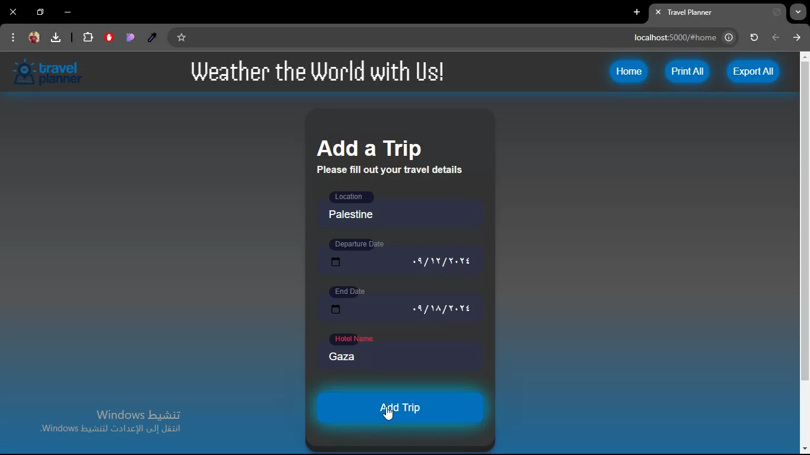

# Travel Planning Application

## Project Description

This Travel Planning Application allows users to seamlessly plan and manage trips by entering a location, travel start and end dates, and a hotel name. The application fetches real-time weather forecasts, location coordinates, relevant images, and additional information about the destination such as its capital city and population.

## Key Features

- **Real-Time Data Integration:**

  - Uses Geonames API for fetching location coordinates.
  - Retrieves weather forecasts using Weatherbit API.
  - Displays images relevant to the destination via Pixabay API.
  - Provides additional details about the location (e.g., capital, population) using Restcountries API.

- **Trip Management:**
  - Users can add multiple trips, and the system automatically arranges them by the start date.
  - Expired trips are visually highlighted for easy recognition.
  - Ability to remove trips from the list.

- **Local Storage:**
  - Trip details are saved locally, allowing users to revisit their plans without losing data.

- **Print and Export:**
  - Users can print all trips or select specific ones.
  - Users can export all trips to PDF format or select specific ones.

## Project Stack
   - Backend: Built using an Express server for handling API requests and serving the application.
   - Frontend: Managed with Webpack, enabling a modular and optimized build process.

This project provides an enhanced user experience by integrating multiple APIs and offering convenient trip management features.

[]([https://drive.google.com/file/d/your-video-id/view](https://drive.google.com/file/d/1F3rO8w2tRjElJtTsOvrLRLdnnU11XQIJ/view?usp=sharing))

## How to Run the App

1. **Clone the Repository:**

   ```bash
   git clone https://github.com/zakaria-ali/Travel-Planner-App.git
   cd Travel-Planner-App

   ```

2. **Install Dependencies:**

   Ensure you have Node.js installed. Then run:
   npm install

3. **Versions:**
   using node -v => v22.4.0
   and npm list =>
   ├── @babel/core@7.25.2

├── @babel/preset-env@7.25.4

├── axios@1.7.5

├── babel-loader@8.3.0

├── clean-webpack-plugin@3.0.0

├── cors@2.8.5

├── css-loader@6.11.0

├── dotenv@16.4.5

├── express@4.19.2

├── html-webpack-plugin@5.6.0

├── jspdf@2.5.1

├── mini-css-extract-plugin@2.9.0

├── node-fetch@3.3.2

├── sass-loader@10.5.2

├── style-loader@3.3.4

├── webpack-cli@5.1.4

├── webpack@5.91.0

└── workbox-webpack-plugin@7.1.0

5. **Run the Development Server:**

   Start the development server with:
   npm run build-dev
   This will start the webpack-dev-server and open the application in your default web browser.

6. **Build for Production:**

   To create a production build of the application, run:
   npm run build-prod
   The production build will be placed in the dist folder.

7. **Start the Backend Server:**

   Run the backend server with:
   npm run start

## Dependencies

- **GEONAMES API Key**
- **Weatherbit API Key**
- **Pixabay API Key**
- **Node.js**
- **npm**
- **Webpack**
- **SCSS**
- **Workbox**
- **Express.js**
- **Babel**
- **Cors**
- **dotenv**

## Configuration

      Create a .env file in the root directory with the following content to set your API key:
      GEONAMES_USERNAME=your_geonames_username
      WEATHERBIT_API_KEY=your_weatherbit_api_key
      PIXABAY_API_KEY=your_pixabay_api_key

## Project Structure

- **src/**

  - **client/** - Contains the frontend code (JavaScript and SCSS).

    - **index.js** - Entry point for the frontend application.
    - **js/** - JavaScript files for client-side functionality.
    - **styles/** - SCSS files for styling.
    - **views/** - HTML files for views.
    - **images/** - Images for the site.


  - **server/** - Contains the backend code (JavaScript and SCSS).
    - **index.js** - Entry point for the backend server.

- **webpack.dev.js** - Webpack configuration for development.
- **webpack.prod.js** - Webpack configuration for production.
- **package.json** - Contains project metadata and dependencies.
- **.env** - Environment variables file.
- **.gitignore** - Specifies files and directories to be ignored by Git.
- **.babelrc** - Babel configuration.
- **README.md** - This file.
